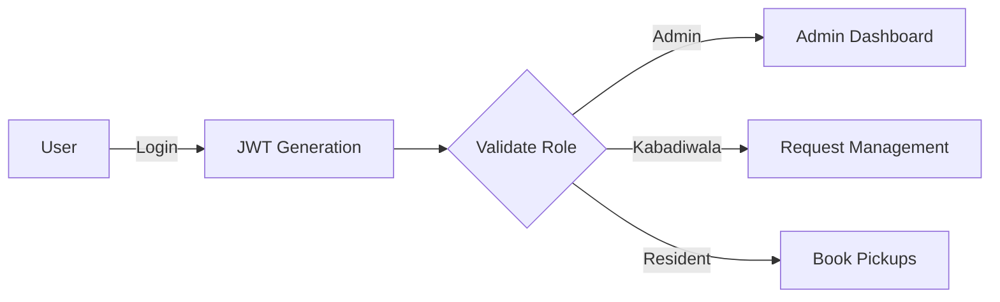

Here’s a polished **README.md** for "The Garbage Wallah" with a structured description, technical breakdown, and testing examples:

---

# 🚮 The Garbage Wallah  
**A Waste Management System with Role-Based Access Control**  
[](https://opensource.org/licenses/MIT)  

A scalable platform connecting **residents**, **kabadiwalas** (waste collectors), and **administrators** to streamline garbage collection. Built for efficient waste disposal, real-time tracking, and secure role-based operations.  

🔗 **Demo**: [Coming Soon]
---

## 🌐 Overview  
**The Garbage Wallah** modernizes waste management by:  
- Allowing residents to schedule pickups and track requests.  
- Enabling kabadiwalas to manage service areas and accept/reject pickups.  
- Providing admins with tools to monitor system health and user activity.  
- Ensuring security through JWT authentication and granular RBAC.  

---

## 🧩 Features  

| Role         | Capabilities                                                                 |
|--------------|------------------------------------------------------------------------------|
| **Resident** | Book pickups, track status, submit feedback, receive notifications          |
| **Kabadiwala**| Manage availability, view area-specific requests, accept/reject pickups    |
| **Admin**    | Audit logs, manage users/appointments, analyze feedback, system monitoring  |

---

## 🛠 Tech Stack  
**Backend**:  
  
  
**Database**:  
  
  
**Security**:  
  
  

---

## 🚀 Getting Started  

### Prerequisites  
- Node.js v18+  
- MongoDB Atlas/local instance  
- Postman/Insomnia for API testing  

### Installation  
```bash
git clone https://github.com/Wizard0880/TheGarbageWallah.git
cd TheGarbageWallah
npm install
```

### Configuration  
Create `.env` file:  
```env
PORT=3000
MONGO_URI=mongodb://localhost:27017/garbage_wallah
JWT_SECRET=your_secure_key_here
JWT_ACCESS_EXPIRY=15m
JWT_REFRESH_EXPIRY=7d
```

### Start Server  
```bash
npm start
```

---

## 📚 API Documentation  

### 👤 Resident Endpoints  

#### Book a Pickup (HTTP)  
```http
POST /api/resident/request-pickup
Authorization: Bearer <ACCESS_TOKEN>
Content-Type: application/json

{
  "scrapType": "Plastic",
  "pickupDate": "2024-07-25T10:00:00Z",
  "address": "22 Green Valley, Mumbai"
}
```

**Response**:  
```json
{
  "success": true,
  "appointment": {
    "id": "667a1b2c3d4e",
    "status": "Pending",
    "assignedKabadiwala": null
  }
}
```

---

### 🧑🔧 Kabadiwala Endpoints  

#### Accept Pickup Request (cURL)  
```bash
curl -X POST "http://localhost:3000/api/kabadiwala/requests/action" \
-H "Authorization: Bearer <KABADI_TOKEN>" \
-H "Content-Type: application/json" \
-d '{"requestId": "667a1b2c3d4e", "action": "accept"}'
```

**Response**:  
```json
{
  "success": true,
  "message": "Request ID 667a1b2c3d4e accepted",
  "updatedStatus": "Accepted"
}
```

---

### 👑 Admin Endpoints  

#### View System Logs (HTTP)  
```http
GET /api/admin/logs
Authorization: Bearer <ADMIN_TOKEN>
```

**Response**:  
```json
{
  "logs": [
    {
      "action": "PICKUP_ACCEPTED",
      "user": "665a1b2c3d4e",
      "timestamp": "2024-07-20T09:30:00Z",
      "details": "Kabadiwala Vijay accepted request"
    }
  ]
}
```

---

## 🛡 Security Architecture  

### RBAC Workflow  


### Middleware Snippet  
```javascript
// Role validation middleware
const authorize = (allowedRoles) => (req, res, next) => {
  if (!allowedRoles.includes(req.user.role)) {
    return res.status(403).json({ 
      code: "RBAC-403",
      message: "Access forbidden for your role" 
    });
  }
  next();
};
```

---

## 📜 License  
MIT License © 2024 TheGarbageWallah Team  

---

For contributions or issues, visit the [GitHub repository](https://github.com/Wizard0880/TheGarbageWallah).
